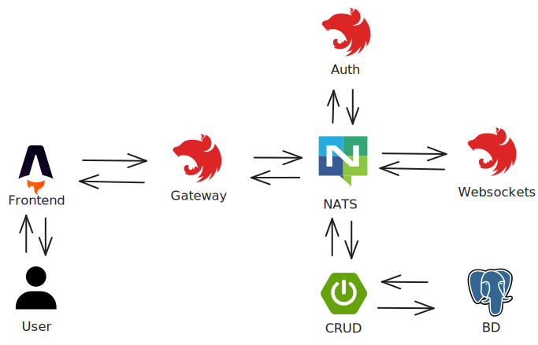

    

# Table of Contents

- [Table of Contents](#table-of-contents)
- [Reservo Background and Purpose](#reservo-background-and-purpose)
- [Reservo Events User MS](#reservo-events-user-ms-)
  - [1. NATS (Primary)](#1-nats-primary)
  - [2. API REST (For Educational Purposes)](#2-api-rest-for-educational-purposes)
  - [Paradigms and Tools Learned](#paradigms-and-tools-learned-️)
- [Environment Setup](#environment-setup-)
  - [Prerequisites](#prerequisites)
  - [Project Initialization](#project-initialization)
- [Licence](#licence)

# Reservo Background and Purpose

Reservo began as a personal project with **the goal of learning and experimenting firsthand with microservices architecture**, understanding both its strengths and challenges while building a solution to manage auditorium reservations.

I also wanted to explore a technology outside the JavaScript ecosystem for building web servers, so I chose Java 17 with Spring Boot as the project's core. This journey allowed me to acquire new knowledge, reinforce best practices, and build a repository designed to offer a clean and maintainable development experience.

I recognize that the distribution of responsibilities among the microservices could have been simplified. However, I wanted to challenge myself by simulating a more complex environment, where orchestrating multiple services simultaneously was necessary. While this made the process more demanding, it also gave me a deeper understanding of what it means to work with this type of architecture at a larger scale.

Reservo is composed of five repositories:

- [Frontend built with Astro and React 🚀](https://github.com/Hector-f-Romero/reservo-front)
- [NestJS API Gateway responsible for routing requests to the appropriate microservice 🧠](https://github.com/Hector-f-Romero/reservo-api-gateway)
- [Spring Boot microservice that handles CRUD operations for core entities 🎨](https://github.com/Hector-f-Romero/reservo-events-user-ms)
- [Hybrid NestJS app that uses WebSockets and communicates across services ⌚](https://github.com/Hector-f-Romero/reservo-ws-ms)
- [NestJS microservice dedicated to authentication 🔐](https://github.com/Hector-f-Romero/reservo-auth-ms)

    

Each repository includes documentation on the main challenges faced and lessons learned throughout development. Looking back, I feel proud of the effort invested and the outcome achieved with this project.

# Reservo Events User MS 👤

This web server provides CRUD operations for the User, Event, and Seat entities, enabling event creation, listing of upcoming events, seat reservation for specific events, and other related functions. The service uses a PostgreSQL 16 database managed via Docker through the `docker-compose.yaml` file.

This project supports two modes of communication:

## 1. NATS (Primary)

This microservice is primarily designed to operate via [NATS](https://nats.io), a lightweight messaging system. A publish/subscribe pattern is used for system events. The logic related to this implementation is organized within subpackages named `nats` under each entity package.

Each of these subpackages typically includes:
- A `Publisher` class to emit events.
- A `NatsController` to listen and respond to NATS messages.
- A list of subjects (event patterns) that the microservice subscribes to.
- A class extending `NatsMessage`, which helps Spring identify which services should handle specific messages.

## 2. API REST (For Educational Purposes)

To gain familiarity with Spring Boot, the initial implementation included traditional REST controllers. These are fully documented using Swagger and serve as examples of RESTful API development in Spring Boot. They were also useful for testing during the early stages of development.

## Paradigms and Tools Learned 🛠️

Throughout the development of this microservice, I gained hands-on experience with several powerful tools and architectural paradigms in the Java ecosystem:

- **JPA & Hibernate**: Allowed the definition of complex entity relationships and data persistence strategies. Additionally, I explored the use of native SQL queries for optimized and custom database operations.
- **Lombok**: Helped reduce boilerplate code by auto-generating getters, setters, constructors, and more, significantly improving readability.
- **MapStruct**: Simplified the mapping between DTOs and entities, promoting a clean separation between API models and internal domain logic.
- **Aspect-Oriented Programming (AOP)**: Thanks for learnt about it, I implemented an error handling during NATS communication was centralized, enabling a cleaner separation of business logic.
- Enabled centralized cross-cutting concerns such as error handling and logging, especially during event-driven communication.
- **Spring Security (spring-boot-starter-security)**: Provided a foundational understanding of how to secure REST endpoints and integrate authorization layers effectively.

Due to my previous experience with NestJs and research in several forums and videos, this project uses a Feature-Based File Structure, which made it easier for me to group the different layers associated to a single entity.

# Environment Setup ⚙

## Prerequisites
- Java 27
- Maven
- Docker Desktop

## Project Initialization

1. Clone this repository and navigate to the project directory.
2. Create the environment variables file with: `cp .env.example .env`.
3. Fill in the required values in the `.env` file.
4. Start the NATS server with: `docker-compose up -d`.
5. Compile the project with: `./mvnw clean install`.
6. Execute the application: `./mvnw spring-boot:run`.
7. Make sure the following services are running:
   - Reservo API Gateway
   - Reservo Auth MS
   - Reservo WebSocket MS.
8. Run the gateway and send an `HTTP POST` request to the `/V1/seed` endpoint to populate the database with test data. For more info, refer to the [gateway repository](https://github.com/Hector-f-Romero/reservo-api-gateway).

> [!NOTE]
> Alternatively, you can send a POST request to `http://localhost:8080/api/v1/seed` directly from this service to seed the database without relying on the gateway.

By default, the API documentation is available at: `http://localhost:8080/api/v1/swagger-ui/index.html` .

# Licence

See the `LICENSE` file for more information.
